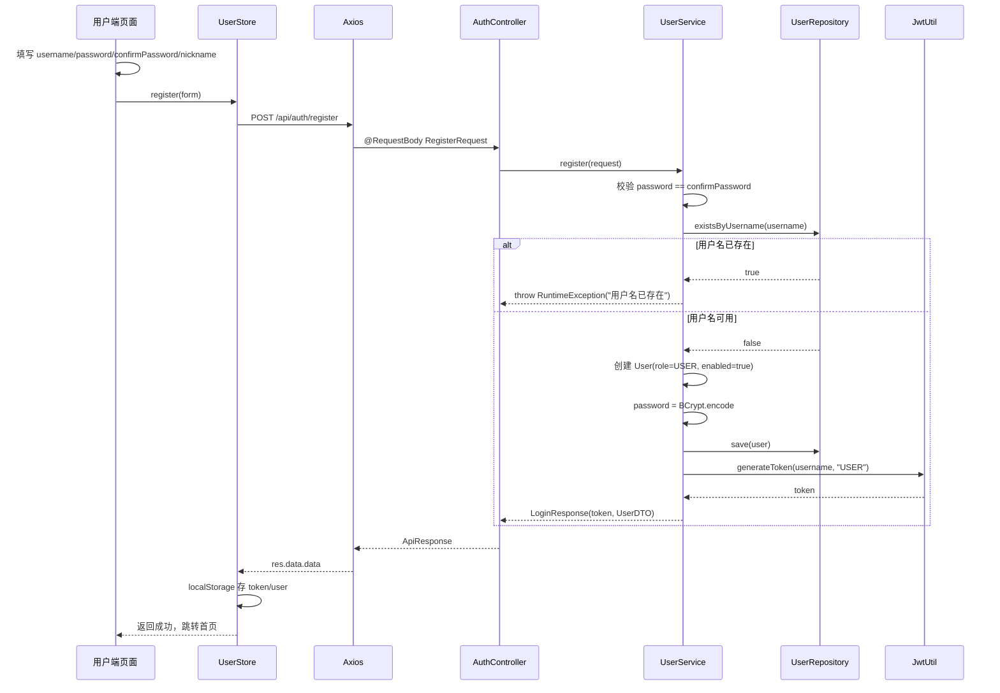
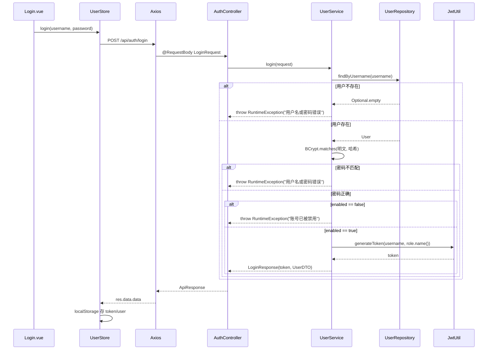
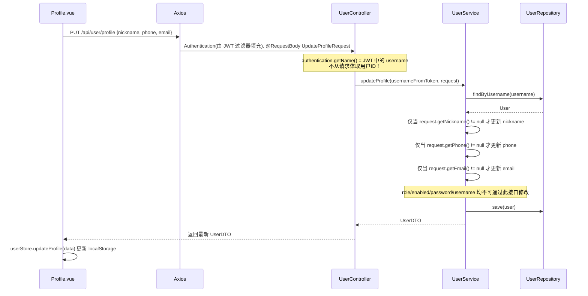
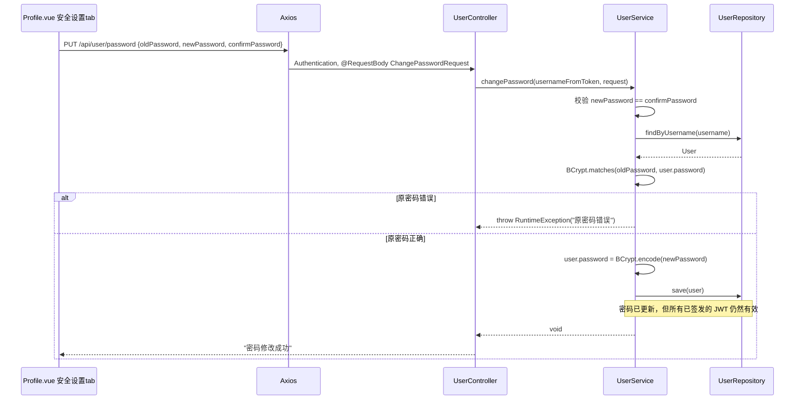
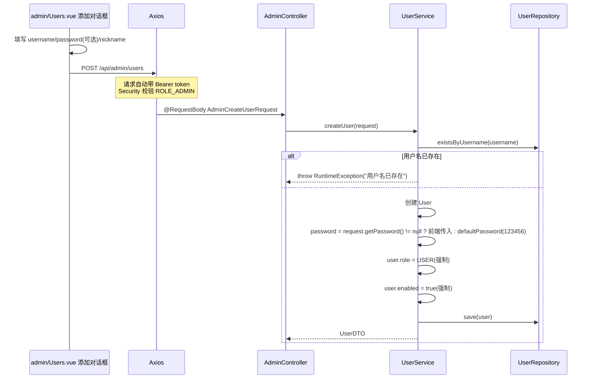
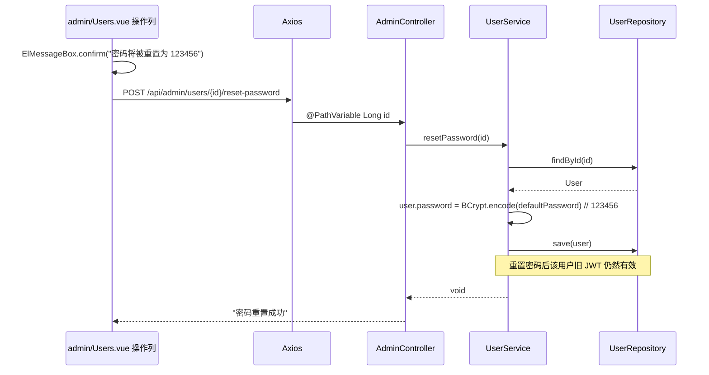
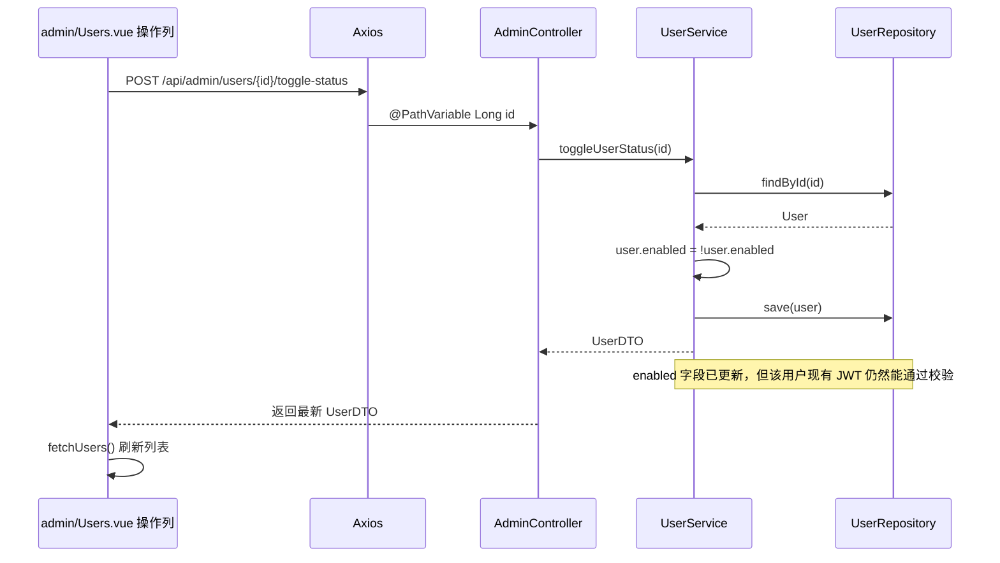
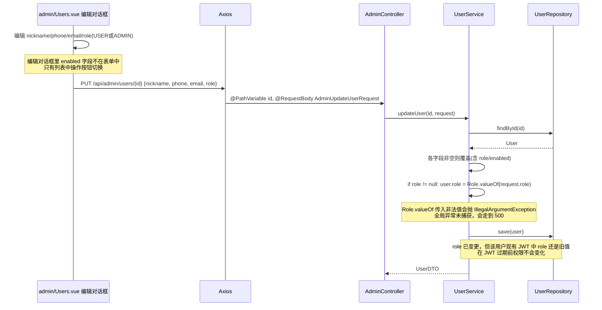

# 代码审查理解文档

## 一、整体架构概览

本项目是一个前后端分离的用户与权限管理系统，包含三个独立应用：

| 模块 | 技术栈 | 定位 |
|------|--------|------|
| backend | Spring Boot 3 + Spring Security + JPA + JJWT + MySQL | RESTful API 服务，提供鉴权与用户管理能力 |
| frontend-admin | Vue 3 + Vite + Pinia + Vue Router + Element Plus | 管理员后台，提供用户列表、新增用户、重置密码、启停账号、角色修改等功能 |
| frontend-user | Vue 3 + Vite + Pinia + Vue Router + Element Plus | 用户端，提供注册、登录、个人资料修改、修改密码等功能 |

### 关键安全组件

- **[SecurityConfig.java](file:///Users/huwenjie/项目/gsb/gsb-01727/backend/src/main/java/com/usermanagement/config/SecurityConfig.java)**：Spring Security 配置，基于 URL 路径做粗粒度权限控制
- **[JwtUtil.java](file:///Users/huwenjie/项目/gsb/gsb-01727/backend/src/main/java/com/usermanagement/security/JwtUtil.java)**：JWT 签发与解析工具，HS256 对称签名
- **[JwtAuthenticationFilter.java](file:///Users/huwenjie/项目/gsb/gsb-01727/backend/src/main/java/com/usermanagement/security/JwtAuthenticationFilter.java)**：每请求一次的 JWT 认证过滤器
- **[DataInitializer.java](file:///Users/huwenjie/项目/gsb/gsb-01727/backend/src/main/java/com/usermanagement/config/DataInitializer.java)**：系统启动时初始化默认账号（admin/admin123, user/user123）

### 后端 URL 权限矩阵

| URL 模式 | 访问权限 |
|----------|----------|
| `/api/auth/**` | 公开（无需认证） |
| `/api/admin/**` | 仅 ROLE_ADMIN |
| `/api/user/**` | 任意已认证用户（USER / ADMIN 均可） |

### 数据库实体

[User.java](file:///Users/huwenjie/项目/gsb/gsb-01727/backend/src/main/java/com/usermanagement/entity/User.java) 实体字段：
- `id`、`username`（唯一）、`password`（BCrypt 哈希）
- `nickname`、`phone`、`email`
- `role`：枚举值 `USER` / `ADMIN`
- `enabled`：布尔值，账号是否启用
- `createdAt`、`updatedAt`

---

## 二、核心业务链路数据流

### 2.1 注册（仅普通用户端）



**关键安全点**：
- 后端在 [UserService.java:38](file:///Users/huwenjie/项目/gsb/gsb-01727/backend/src/main/java/com/usermanagement/service/UserService.java#L38) 强制 `user.setRole(User.Role.USER)`，即使前端（RegisterRequest）根本没有 role 字段，也不信任任何外部传入的角色声明
- 后端强制 `user.setEnabled(true)`，注册用户默认启用
- 密码使用 BCryptPasswordEncoder 加密存储，不明文保存

**涉及文件**：
- 前端：[Register.vue](file:///Users/huwenjie/项目/gsb/gsb-01727/frontend-user/src/views/Register.vue)、[user.js](file:///Users/huwenjie/项目/gsb/gsb-01727/frontend-user/src/stores/user.js#L32-L39)
- 后端：[AuthController.java](file:///Users/huwenjie/项目/gsb/gsb-01727/backend/src/main/java/com/usermanagement/controller/AuthController.java#L16-L19)、[UserService.java:26-45](file:///Users/huwenjie/项目/gsb/gsb-01727/backend/src/main/java/com/usermanagement/service/UserService.java#L26-L45)

---

### 2.2 登录（两个前端均可）



**关键安全点**：
- 用户名不存在和密码错误返回相同提示（"用户名或密码错误"），防止用户名枚举
- **只在登录时检查 `enabled` 状态**，已持有有效 JWT 的请求不会再次检查（详见风险章节）
- 登录成功即签发新 JWT，旧 JWT 不会被作废

**涉及文件**：
- 前端：[frontend-admin/Login.vue](file:///Users/huwenjie/项目/gsb/gsb-01727/frontend-admin/src/views/Login.vue)、[frontend-user/Login.vue](file:///Users/huwenjie/项目/gsb/gsb-01727/frontend-user/src/views/Login.vue)
- 后端：[AuthController.java:21-24](file:///Users/huwenjie/项目/gsb/gsb-01727/backend/src/main/java/com/usermanagement/controller/AuthController.java#L21-L24)、[UserService.java:47-61](file:///Users/huwenjie/项目/gsb/gsb-01727/backend/src/main/java/com/usermanagement/service/UserService.java#L47-L61)

---

### 2.3 JWT 校验（全局过滤器）

```mermaid
flowchart TD
    A[HTTP 请求] --> B{Authorization header<br/>以 Bearer 开头?}
    B -->|否| F[继续过滤链<br/>SecurityContext 为空]
    B -->|是| C[提取 token 字符串]
    C --> D{jwtUtil.validateToken(token)<br/>签名/过期校验}
    D -->|无效| F
    D -->|有效| E[从 token 中解析 username 和 role]
    E --> G[构造 UsernamePasswordAuthenticationToken<br/>principal=username<br/>authorities=[ROLE_role]]
    G --> H[设置 SecurityContextHolder.context.authentication]
    H --> F
    F --> I[进入 Spring Security 权限校验]
    I --> J{匹配 /api/admin/**?}
    J -->|是| K{authorities 含 ROLE_ADMIN?}
    K -->|否| L[返回 403]
    K -->|是| M[放行到 Controller]
    J -->|否| N{匹配 /api/auth/**?}
    N -->|是| M
    N -->|否| O{已认证?}
    O -->|否| P[返回 401]
    O -->|是| M
```

**关键安全点**：
- **JwtAuthenticationFilter 只做 JWT 签名和过期校验，完全不查询数据库**
- SecurityContext 中的 principal 就是 JWT 里的 username 字符串，角色直接取 JWT claim 中的 role
- 过滤器不会去查 `users` 表来验证用户当前是否仍 enabled、角色是否已变更
- 这是后续多个风险的根本原因

**涉及文件**：
- [JwtAuthenticationFilter.java:24-44](file:///Users/huwenjie/项目/gsb/gsb-01727/backend/src/main/java/com/usermanagement/security/JwtAuthenticationFilter.java#L24-L44)
- [SecurityConfig.java:43-48](file:///Users/huwenjie/项目/gsb/gsb-01727/backend/src/main/java/com/usermanagement/config/SecurityConfig.java#L43-L48)

---

### 2.4 个人资料修改（普通用户 / 管理员均可访问 /api/user/**）



**关键安全点**：
- 用户身份完全来自 JWT token 解析出的 username，Controller 通过 `Authentication.getName()` 获取
- [UpdateProfileRequest](file:///Users/huwenjie/项目/gsb/gsb-01727/backend/src/main/java/com/usermanagement/dto/UpdateProfileRequest.java) 只有 nickname/phone/email 三个字段，没有 role/enabled 字段
- Service 层使用 `if (field != null)` 的部分更新模式，不会覆盖未传字段
- 普通用户和管理员登录后都可以调用此接口修改"自己"的资料，但改的是各自账号的资料

**涉及文件**：
- 前端：[frontend-admin/Profile.vue](file:///Users/huwenjie/项目/gsb/gsb-01727/frontend-admin/src/views/Profile.vue)、[frontend-user/Profile.vue](file:///Users/huwenjie/项目/gsb/gsb-01727/frontend-user/src/views/Profile.vue)
- 后端：[UserController.java:22-27](file:///Users/huwenjie/项目/gsb/gsb-01727/backend/src/main/java/com/usermanagement/controller/UserController.java#L22-L27)、[UserService.java:69-86](file:///Users/huwenjie/项目/gsb/gsb-01727/backend/src/main/java/com/usermanagement/service/UserService.java#L69-L86)

---

### 2.5 修改密码（当前登录用户自助修改）



**关键安全点**：
- 需要验证 oldPassword，这是正确的设计，防止 token 被盗后被人改密码
- **但修改密码后不会使已有的 JWT token 失效**（详见风险章节）
- 同样使用 `Authentication.getName()` 获取当前用户，不能改别人密码

**涉及文件**：
- [UserController.java:29-35](file:///Users/huwenjie/项目/gsb/gsb-01727/backend/src/main/java/com/usermanagement/controller/UserController.java#L29-L35)、[UserService.java:88-103](file:///Users/huwenjie/项目/gsb/gsb-01727/backend/src/main/java/com/usermanagement/service/UserService.java#L88-L103)

---

### 2.6 管理员新增用户



**关键安全点**：
- URL `/api/admin/**` 被 SecurityConfig 限制为 `hasRole("ADMIN")`，普通用户即使知道接口也调不通
- [AdminCreateUserRequest](file:///Users/huwenjie/项目/gsb/gsb-01727/backend/src/main/java/com/usermanagement/dto/AdminCreateUserRequest.java) 中没有 role/enabled 字段，后端强制 role=USER、enabled=true
- **管理员创建用户时不能直接指定角色为 ADMIN**，必须创建后再通过编辑接口修改
- password 是可选字段，不传时使用配置中的默认密码 `123456`（详见风险章节）
- 前端添加用户对话框确实没有 role 选项（[Users.vue:86-108](file:///Users/huwenjie/项目/gsb/gsb-01727/frontend-admin/src/views/Users.vue#L86-L108)），只有编辑时才有

**涉及文件**：
- [AdminController.java:28-31](file:///Users/huwenjie/项目/gsb/gsb-01727/backend/src/main/java/com/usermanagement/controller/AdminController.java#L28-L31)、[UserService.java:118-134](file:///Users/huwenjie/项目/gsb/gsb-01727/backend/src/main/java/com/usermanagement/service/UserService.java#L118-L134)

---

### 2.7 管理员重置密码



**关键安全点**：
- 重置后的固定密码是 `123456`，前端确认弹窗直接写死了这个值（[Users.vue:190](file:///Users/huwenjie/项目/gsb/gsb-01727/frontend-admin/src/views/Users.vue#L190)）
- 不需要用户当前密码，管理员可强制重置任何账号
- **重置后用户的旧 JWT 不会失效**，如果用户之前已登录，在 JWT 过期前他仍能正常使用（密码已变但旧 token 仍有效）

**涉及文件**：
- [AdminController.java:40-44](file:///Users/huwenjie/项目/gsb/gsb-01727/backend/src/main/java/com/usermanagement/controller/AdminController.java#L40-L44)、[UserService.java:161-167](file:///Users/huwenjie/项目/gsb/gsb-01727/backend/src/main/java/com/usermanagement/service/UserService.java#L161-L167)

---

### 2.8 管理员启停账号



**关键安全点（重大）**：
-  toggle 操作就是取反 `enabled` 字段，没有任何额外保护
- **JwtAuthenticationFilter 不校验 `user.enabled`**！所以用户被禁用后，他已经持有的有效 JWT 在过期之前仍可以正常访问所有 `/api/user/**` 接口
- 被禁用的用户只是不能"重新登录"（[UserService.java:55-57](file:///Users/huwenjie/项目/gsb/gsb-01727/backend/src/main/java/com/usermanagement/service/UserService.java#L55-L57) 在登录时检查 enabled），但已登录的会话不受影响
- 接口不检查操作对象是否是当前管理员自己——管理员可以禁用自己（如果只有一个管理员则可能自锁）
- 接口不检查目标是否为另一个管理员——任意管理员可以禁用其他管理员

**涉及文件**：
- [AdminController.java:46-49](file:///Users/huwenjie/项目/gsb/gsb-01727/backend/src/main/java/com/usermanagement/controller/AdminController.java#L46-L49)、[UserService.java:169-176](file:///Users/huwenjie/项目/gsb/gsb-01727/backend/src/main/java/com/usermanagement/service/UserService.java#L169-L176)

---

### 2.9 管理员编辑用户（含角色修改）

编辑功能是通过 `PUT /api/admin/users/{id}` 实现的，和启停账号同用一个接口路径但方法不同。



**关键安全点**：
- [AdminUpdateUserRequest](file:///Users/huwenjie/项目/gsb/gsb-01727/backend/src/main/java/com/usermanagement/dto/AdminUpdateUserRequest.java) 有 `role` 和 `enabled` 字段，管理员可以通过此接口修改任意用户（包括其他管理员）的角色
- 前端编辑对话框只暴露了 nickname/phone/email/role 的修改入口，没有 enabled 开关（enabled 用 toggle-status 单独接口）
- 但后端 AdminUpdateUserRequest 里有 `enabled` 字段，所以管理员实际上可以在编辑接口里直接传 `enabled: false` 来禁用用户，不一定非要走 toggle-status
- **角色修改后立即生效的只有"未来的新登录"，用户当前会话持有的 JWT 仍使用旧角色**——如果把 ADMIN 降为 USER，该管理员在 JWT 过期前仍能访问 /api/admin/**

**涉及文件**：
- [AdminController.java:33-38](file:///Users/huwenjie/项目/gsb/gsb-01727/backend/src/main/java/com/usermanagement/controller/AdminController.java#L33-L38)、[UserService.java:136-159](file:///Users/huwenjie/项目/gsb/gsb-01727/backend/src/main/java/com/usermanagement/service/UserService.java#L136-L159)

---

## 三、前后端信任边界与不信任字段清单

| 接口 | 前端可能传入但后端不信任/忽略的字段 | 后端强制覆盖的字段 |
|------|----------------------------------|-------------------|
| POST /api/auth/register | role, enabled, id | role=USER, enabled=true |
| POST /api/auth/login | — | — |
| PUT /api/user/profile | role, enabled, username, password | — |
| PUT /api/user/password | — | —（身份从 Authentication 取） |
| POST /api/admin/users | role, enabled | role=USER, enabled=true |
| PUT /api/admin/users/{id} | id（路径参数优先，不在 body） | —（role/enabled 允许改，因为是管理员接口） |
| POST /api/admin/users/{id}/reset-password | — | 密码强制为 defaultPassword |
| POST /api/admin/users/{id}/toggle-status | — | enabled 字段取反 |

**特别注意**：所有 `/api/user/**` 接口中，目标用户身份来自 JWT（`Authentication.getName()`），而不是请求体或路径参数，因此普通用户无法越权操作其他用户的数据。这部分设计是安全的。

---

## 四、风险清单（按优先级排序）

### 🔴 风险 1：账号禁用后已签发 JWT 仍然有效（高危）

**代码依据**：
- [JwtAuthenticationFilter.java:30-39](file:///Users/huwenjie/项目/gsb/gsb-01727/backend/src/main/java/com/usermanagement/security/JwtAuthenticationFilter.java#L30-L39)：只验证 token 签名，不查数据库
- [UserService.java:169-176](file:///Users/huwenjie/项目/gsb/gsb-01727/backend/src/main/java/com/usermanagement/service/UserService.java#L169-L176)：toggleUserStatus 只改 DB，不影响已有 token

**问题描述**：管理员点击"禁用"后，`users.enabled` 字段变为 false，但被禁用用户在 JWT 24小时有效期内仍可正常访问 `/api/user/profile`、`/api/user/password` 等接口，能读/改自己的资料和密码。禁用操作仅阻止该用户"重新登录"，不能终止其当前会话。

**同理**：角色变更（ADMIN ↔ USER）后，用户已持有的 token 在过期前仍使用旧角色，导致提权生效延迟或降权无效。

---

### 🔴 风险 2：修改密码 / 重置密码后旧 JWT 不失效（高危）

**代码依据**：
- [UserService.java:88-103](file:///Users/huwenjie/项目/gsb/gsb-01727/backend/src/main/java/com/usermanagement/service/UserService.java#L88-L103)：changePassword 只更新 DB 密码，不做 token 作废
- [UserService.java:161-167](file:///Users/huwenjie/项目/gsb/gsb-01727/backend/src/main/java/com/usermanagement/service/UserService.java#L161-L167)：resetPassword 同样不做 token 作废

**问题描述**：如果用户的 JWT 已经泄漏（比如在公共电脑上登录未退出，或 token 被 XSS 窃取），即使受害者修改了密码，攻击者持有的旧 token 在过期前仍可继续使用。管理员重置密码场景也类似——重置后用户被踢下线的预期无法实现，旧 token 仍有效。

---

### 🟠 风险 3：重置密码 / 新建用户默认密码硬编码为 123456（中高危）

**代码依据**：
- [application.yml:23-24](file:///Users/huwenjie/项目/gsb/gsb-01727/backend/src/main/resources/application.yml#L23-L24)：`app.default-password: 123456`
- [UserService.java:126](file:///Users/huwenjie/项目/gsb/gsb-01727/backend/src/main/java/com/usermanagement/service/UserService.java#L126)：不传密码就用 defaultPassword
- [UserService.java:165](file:///Users/huwenjie/项目/gsb/gsb-01727/backend/src/main/java/com/usermanagement/service/UserService.java#L165)：resetPassword 重置为 defaultPassword
- [frontend-admin/Users.vue:190](file:///Users/huwenjie/项目/gsb/gsb-01727/frontend-admin/src/views/Users.vue#L190)：前端弹窗直接写死"密码将被重置为 123456"

**问题描述**：
1. 123456 是极弱密码，在撞库/暴力破解场景下极其危险
2. 管理员重置密码后，用户可能长期不修改默认密码
3. 后端没有"首次登录/重置后必须修改密码"的强制机制
4. 默认密码写死在 yml 中，虽然可通过环境变量覆盖，但默认值本身太弱

---

### 🟠 风险 4：管理员操作无自我保护及同级保护（中危）

**代码依据**：
- [UserService.java:169-176](file:///Users/huwenjie/项目/gsb/gsb-01727/backend/src/main/java/com/usermanagement/service/UserService.java#L169-L176)：toggleUserStatus 不检查目标 id 是否是当前用户
- [UserService.java:136-159](file:///Users/huwenjie/项目/gsb/gsb-01727/backend/src/main/java/com/usermanagement/service/UserService.java#L136-L159)：updateUser 不检查目标角色是否为 ADMIN

**问题描述**：
1. 管理员可以禁用自己的账号，如果系统中只有一个管理员，会导致后台永久锁死
2. 任意管理员可以禁用/降权其他管理员，没有任何制衡机制
3. 任意管理员可以将任意普通用户提权为 ADMIN，无审批、无二次确认
4. 初始 admin 账号（DataInitializer 创建的）可以被其他管理员禁用或删除（虽然目前没有删除接口）

---

### 🟠 风险 5：AdminUpdateUserRequest.role 传入非法值导致 500（中危）

**代码依据**：
- [UserService.java:151](file:///Users/huwenjie/项目/gsb/gsb-01727/backend/src/main/java/com/usermanagement/service/UserService.java#L151)：`User.Role.valueOf(request.getRole())`
- [GlobalExceptionHandler.java:35-39](file:///Users/huwenjie/项目/gsb/gsb-01727/backend/src/main/java/com/usermanagement/exception/GlobalExceptionHandler.java#L35-L39)：兜底 Exception 直接返回 500 "服务器内部错误"

**问题描述**：前端只提供 USER/ADMIN 两个选项，但如果有人绕过前端直接调用 API 传入 role="SUPER" 或 role=""，会触发 `IllegalArgumentException`（枚举 valueOf 失败），被全局兜底处理器捕获，返回 HTTP 500。这暴露了后端未做参数校验的问题，错误信息也不利于前端处理。AdminUpdateUserRequest 的 role 字段没有 `@Pattern` 或自定义校验器约束合法值。

同理，enabled 字段如果传入非布尔值也会有问题（但 Spring 会自动类型转换失败返回 400）。

---

### 🟡 风险 6：CORS 配置过于宽松（低中危）

**代码依据**：
- [SecurityConfig.java:57](file:///Users/huwenjie/项目/gsb/gsb-01727/backend/src/main/java/com/usermanagement/config/SecurityConfig.java#L57)：`setAllowedOriginPatterns(List.of("*"))`
- [SecurityConfig.java:60](file:///Users/huwenjie/项目/gsb/gsb-01727/backend/src/main/java/com/usermanagement/config/SecurityConfig.java#L60)：`setAllowCredentials(true)`

**问题描述**：`allowedOriginPatterns("*")` + `allowCredentials(true)` 组合意味着任意网站的脚本都可以携带 cookie/Authorization 头向本 API 发请求（在配合浏览器 CORS 预检的情况下）。对于使用 Bearer token 的 JWT 认证模式，风险相比 cookie session 模式小一些（不会自动附带），但仍是不安全的配置，应限制为已知前端域名。

---

### 🟡 风险 7：JWT 密钥有硬编码默认值（低中危）

**代码依据**：
- [application.yml:20](file:///Users/huwenjie/项目/gsb/gsb-01727/backend/src/main/resources/application.yml#L20)：`secret: ${JWT_SECRET:mySecretKeyForJWTTokenGenerationThatIsLongEnoughForHS256Algorithm}`

**问题描述**：如果生产环境部署时忘记设置 JWT_SECRET 环境变量，所有部署实例使用同一个公开的默认密钥。知道这个密钥的人可以自行签发任意角色的 JWT（包括 ADMIN），直接接管所有账号。虽然密钥长度看起来够 HS256，但公开默认值本身是安全隐患。

---

### 🟡 风险 8：前端路由权限控制依赖 localStorage（低危）

**代码依据**：
- [frontend-admin/router/index.js:39](file:///Users/huwenjie/项目/gsb/gsb-01727/frontend-admin/src/router/index.js#L39)：`userStore.user?.role !== 'ADMIN'`
- user 对象从 localStorage 读取，用户可通过浏览器 DevTools 手动修改 localStorage 里 `user.role` 为 `"ADMIN"`

**问题描述**：普通用户登录 user 端后，如果把 localStorage 中 user.role 改成 ADMIN 然后访问 admin 前端地址，可以看到管理后台页面并尝试调用接口。但后端 `/api/admin/**` 有真正的 `hasRole("ADMIN")` 校验，所以 API 会返回 403。**这不是后端漏洞**，但前端体验差——用户能看到页面组件但操作全部报错。建议前端在收到 403 时也要做跳转处理，或者在 App 初始化时从后端重新拉一次用户信息来校验。

---

### 🟡 风险 9：401 处理逻辑对"禁用用户持有效 token"场景不生效（低危）

**代码依据**：
- 两个前端的 axios 拦截器都只在 `error.response?.status === 401` 时清 token 跳登录
- 后端对于账号被禁用但 JWT 仍有效的请求，不会返回 401 或 403，而是正常处理（因为 JwtAuthenticationFilter 认为它是有效认证）
- 只有登录接口对禁用账号返回 400（"账号已被禁用"）

**问题描述**：管理员在后台禁用了某用户，该用户继续操作前端页面时，所有已认证接口都能正常响应（因为 token 是有效的），前端感知不到自己已被禁用，直到 token 过期后尝试重新登录才会发现。这和"禁用"的预期不符。

---

### 🟡 风险 10：异常处理粒度太粗（低危）

**代码依据**：
- [GlobalExceptionHandler.java:15-19](file:///Users/huwenjie/项目/gsb/gsb-01727/backend/src/main/java/com/usermanagement/exception/GlobalExceptionHandler.java#L15-L19)：所有 RuntimeException 统一返回 400
- "用户不存在"、"用户名或密码错误"、"原密码错误"、"账号已被禁用" 等不同语义的错误全部 HTTP 400

**问题描述**：前端 axios 拦截器只对 HTTP 401 做登出处理，对 403 没有特殊处理。目前系统中不存在真正的 401（Spring Security 认证失败默认返回 403 而不是 401，取决于配置），JWT 过滤器没有主动设置 401 响应。这导致前后端错误语义不完全一致——前端拦截器期望 401 触发"未登录"跳转，但后端在未认证时默认返回 403。

---

## 五、最需要优先验证的场景

按业务影响排序，建议立即验证以下场景：

### 第一优先级（安全核心）

| # | 验证场景 | 预期正确行为 | 当前可能的实际行为 |
|---|---------|------------|-----------------|
| 1 | 用户 A 登录后，管理员在后台禁用 A，A 使用原 token 访问 `GET /api/user/profile` | 应返回 401/403，提示账号已禁用 | 可能正常返回 200 和用户数据 |
| 2 | 用户 A 登录后，自己修改密码，用旧 token 请求 `PUT /api/user/profile` | 应返回 401，要求重新登录 | 可能正常修改成功 |
| 3 | 管理员 B 把管理员 A 的角色改为 USER，A 用原 token 请求 `GET /api/admin/users` | 应返回 403 | 可能仍能获取用户列表（JWT 中 role 仍是 ADMIN） |

### 第二优先级（账号安全）

| # | 验证场景 | 预期正确行为 | 当前可能的实际行为 |
|---|---------|------------|-----------------|
| 4 | 管理员重置用户 C 的密码后，C 的旧 token 是否能继续使用 | 旧 token 应立即失效 | 可能仍可正常使用 |
| 5 | 管理员创建用户时不传密码字段，新用户密码是否为 123456 且能正常登录 | 应使用随机密码或强制首次修改 | 密码确实是 123456（已确认但安全性弱） |
| 6 | 管理员尝试禁用自己的账号 | 应禁止或至少二次警告 | 可能成功禁用，导致自锁 |
| 7 | 直接通过 API 调 PUT `/api/admin/users/{id}` 传入 role 的非法值（如 `role="GOD"`） | 应返回 400 参数错误 | 可能返回 500 |

### 第三优先级（前后端一致性）

| # | 验证场景 | 预期正确行为 | 当前可能的实际行为 |
|---|---------|------------|-----------------|
| 8 | 普通用户手动修改 localStorage.user.role 为 ADMIN 后访问 admin 前端 /users 页面 | 应被后端拦截并返回 403，前端应友好处理 | 页面可能可以渲染但 API 全报 403 |
| 9 | 不带 token 请求 `/api/user/profile` | 应返回 401，前端跳登录 | 可能返回 403（Spring 默认行为），但前端拦截器只在 401 时跳登录，需要确认 |
| 10 | 同一账号在两个浏览器窗口同时登录，改密码后另一窗口行为 | 另一窗口应提示会话失效 | 可能仍能继续操作直到 JWT 过期 |

---

## 六、总结

### 做得好的地方
1. `/api/user/**` 的身份来源统一使用 JWT 解析的 Authentication，不接受前端传入的用户 ID，防止了水平越权
2. 注册和管理员新增用户时强制 role=USER，不信任前端传入的角色字段
3. 密码全部使用 BCrypt 哈希存储，登录时使用 BCrypt.matches，不明文处理
4. 登录接口对"用户不存在"和"密码错误"返回相同提示，防止用户名枚举
5. 所有写操作都使用 `@Transactional`，DTO 字段基本都有 Jakarta Validation 注解

### 核心架构问题
系统采用 **无状态 JWT** 方案，但没有配套的 **token 失效机制**（无黑名单、无版本号、无 lastPasswordChange 校验、无会话表），JWT 一旦签发就是"信用凭证"，直到过期。这导致：
- 改密码不踢人
- 重置密码不踢人
- 禁用账号不踢人
- 角色变更不实时生效

这些不是 bug，而是无状态 JWT 的固有特性在未补充失效机制时的必然结果。如果要解决，可考虑在 JWT 中加入如 `iat`（签发时间）或 `pwdVersion`，在过滤器中查 DB 对比 `user.updatedAt` 或密码版本号；或者引入 Redis 维护 token 黑名单。
